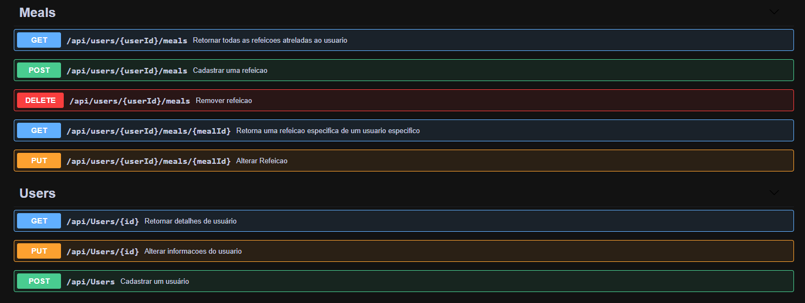

# DevFitness - Jornada .NET Direto ao Ponto 📘
Foi desenvolvida uma API REST completa de gerenciamento de refeições e informações calóricas delas, junto com os dados do usuário.

## Pre requisitos para rodar o projeto  ❗

-   Visual Studio 2019, Visual Studio Code
-   .NET 5.0
-   SQL Server

## Tecnologias & Práticas Implementadas  ⚙

-   ASP.NET Core com .NET 5
-   Entity Framework Core
-   Swagger
-   AutoMapper
-   Injeção de Dependência
-   Publicação na nuvem

## Funcionalidades ✒️

-   Cadastro, Listagem, Detalhes, Atualização e Remoção de Refeição.
-   Cadastro e atualização de Usuário
-   Geração de dados para relatório de balanço energético

## Casos de uso - Preview 📰

